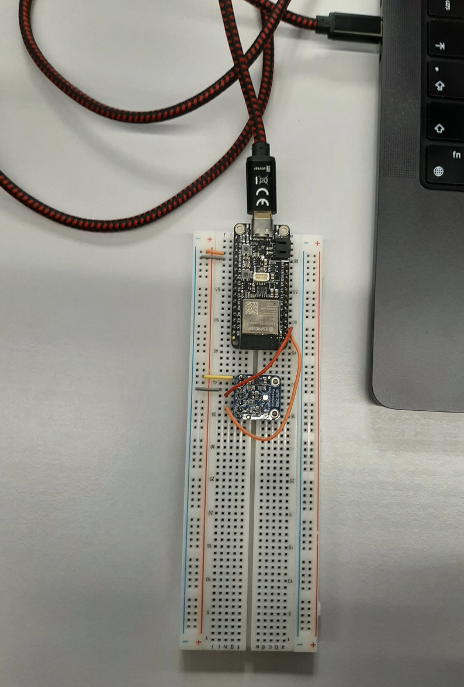

# Fuzzy_project_heating

This project was done in the context of the fuzzy sets lecture at Unifr.

We are implementing a "Self-heating system, finding balance between comfort and resources", using fuzzy methods.

# Introduction

Keeping a comfortable temperature, avoiding big temperature changes, saving energy and taking into account the humidity of the room, these are some of the multiple issues that have to be dealt with when conceiving an autonomous heating system. Nowadays, most heating systems work on crisp values, using a thermostat. However, these kinds of crisp heating systems cannot take into account people’s feelings, humidity or ecological concerns. Even if the temperature is low, the relative feeling can differ quite a lot between people. This is why we aim to implement a fuzzy system able to obviate the problems that arise from the usage of a CRISP method.

# Model used

For this project we inplemented four variables as input: temperature, humidity, feeling, ecology, that impact a consequent: heat (the temperature to be reached), using a fuzzy system. First, the inputs are fuzzyfied using membership functions. Then, fuzzy computations are carried out using Mamdani rules and the result is defuzzyfied with the centroid method. This can be manually tested with the Fuzzy_heating_rules.ipynb notebook.

# Sensor setup

The setup of the sensor, the arduino and the cables connections can be done as depicted on the following picture:



# How to use?

Our program can be used in two ways:

- by manually parsing the inputs using the file _Fuzzy_heating_rules.ipynb_
- having the inputs coming from the sensor and the interactive interface using the set up in the folder _FuzzyprogWebSensor_

### Manual simulation

Done by changing these values in the before last cell of _Fuzzy_heating_rules.ipynb_

```
heating_sim.input['temperature'] =  18  #temperature [-44; 85] °C
heating_sim.input['humidity'] =  60  # humidity [0; 100] %
heating_sim.input['feeling'] =  3 #feeling [0; 10] from freezing to scortching
heating_sim.input['ecology'] =  2  # ecology [0; 10] the higher the more ecological consciousness
```

and running the whole program

### Web page simulation

- connect the BME280 sensor to your device and check the corresponding port; update the port in the code if necessary (COM3 by default)
- follow the instructions in the folder /FuzzyprogWebSensor

# Evaluation

The evaluation of our system was carried out using a survey. In this survey, people had to decide for different situations (temperature, humidity, feeling, ecological concerns), on a scale from 0 to 5, if they prefer a predefined fixed threshold (0) of if they prefer the output of our fuzzy heating system (5). The analysis of the results can be found in the document "Evalutation Part.pdf".
